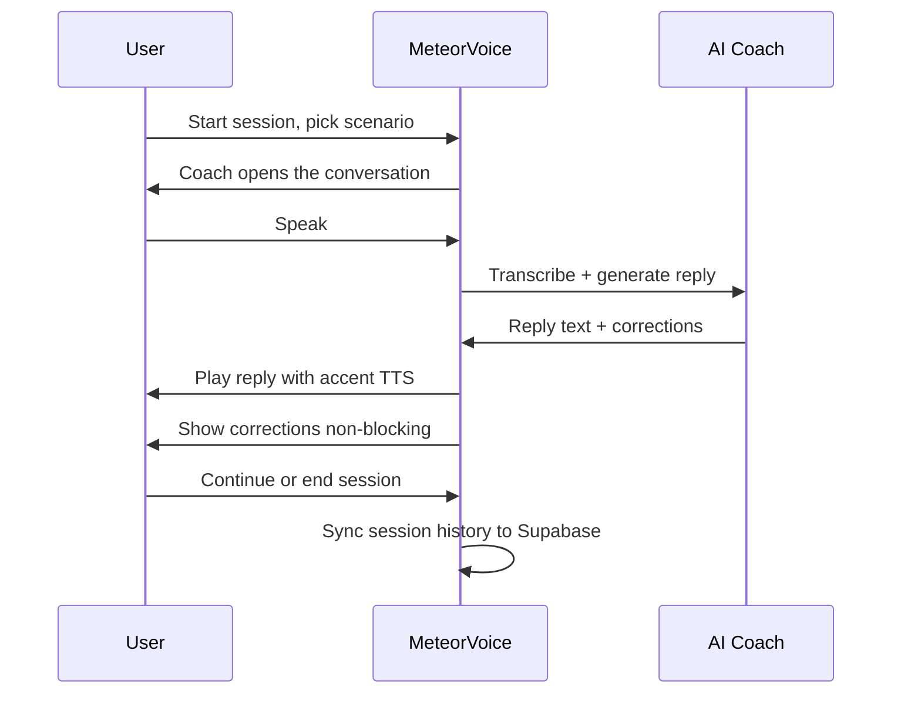
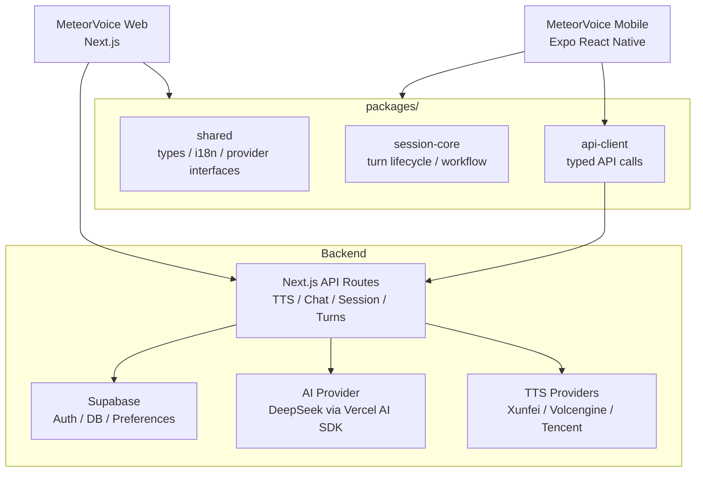
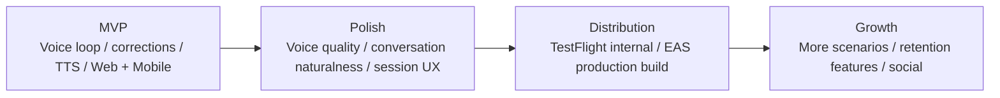

# MeteorVoice

<p align="center">
  <strong>A voice-first English conversation coach with live correction, accent adaptation, and cross-device sync</strong>
</p>

<p align="center">
  
  
  
  
  <br />
  <a href="https://github.com/JunchenMeteor/MeteorVoice/issues"></a>
  <br />
  <a href="README.md"></a>
  <a href="README.zh-CN.md"></a>
</p>

MeteorVoice is a voice-first English conversation coach. The user picks a scenario, speaks naturally, receives live corrections, and hears the AI coach reply with an adapted accent. Sessions are synced across devices through Supabase.

## Table of Contents

- [Maintainer](#maintainer)
- [Background](#background)
- [Core Capabilities](#core-capabilities)
- [System Architecture](#system-architecture)
- [Project Structure](#project-structure)
- [Setup](#setup)
- [Run](#run)
- [Mobile](#mobile)
- [TTS Providers](#tts-providers)
- [Validation](#validation)
- [Roadmap](#roadmap)

## Maintainer

MeteorVoice is initiated and maintained by **Meteor**.

The project focuses on spoken English practice through natural AI conversation, real-time correction feedback, and voice quality that feels close to a real coach. The goal is not a grammar drill tool, but a product where users actually want to keep talking.

## Background

Most English learning apps fall into one of two traps:

- They are reading or writing tools dressed up as speaking practice.
- They use voice input but reply with robotic TTS that breaks immersion immediately.

MeteorVoice is built around the opposite assumption: voice quality and conversation naturalness come first. Corrections are non-blocking and appear alongside the conversation, not as interruptions. The AI coach follows what the user says instead of redirecting to scripted prompts.



## Core Capabilities

- One-to-one voice conversation with an AI coach
- Scenario-based conversation starters (interview, travel, restaurant, workplace, small talk)
- Live correction with grammar, vocabulary, fluency, and pronunciation feedback
- Accent adaptation across sessions (American, British, Indian, Australian, and more)
- Non-blocking correction panel — corrections appear without interrupting the conversation
- Bilingual UI (English and Chinese) outside the conversation area
- Theme switching with CSS custom properties
- Login, session history, and preference sync through Supabase
- Mock AI/STT/TTS providers for local development without API keys
- Native mobile client (iOS/Android) via Expo React Native

## System Architecture



Responsibility boundaries:

- `apps/web`: Next.js full-stack app — UI, API routes, server-side TTS/AI orchestration.
- `apps/mobile`: Expo React Native native client — voice session UI, native audio, background keep-alive.
- `packages/shared`: cross-client types, i18n strings, provider interfaces, TTS capabilities.
- `packages/session-core`: platform-neutral turn lifecycle and workflow state machine.
- `packages/api-client`: typed API calls shared by Web and Mobile.

## Project Structure

```text
MeteorVoice/
├── apps/
│   ├── web/                  Next.js web app
│   │   ├── app/              pages and API routes
│   │   ├── components/       reusable UI components
│   │   └── lib/
│   │       ├── providers/    TTS / STT / AI adapters
│   │       └── server/       server-only business logic
│   └── mobile/               Expo React Native app
├── packages/
│   ├── shared/               types, i18n, provider interfaces
│   ├── session-core/         turn lifecycle and workflow
│   └── api-client/           typed API client
├── supabase/migrations/      ordered SQL migration files
└── docs/                     product and architecture docs
```

See `docs/project-structure.md` for layering rules and architecture decisions.

## Setup

### 1. Install dependencies

```bash
npm install
```

### 2. Create a Supabase project

Create a free project at [supabase.com](https://supabase.com), then run these migrations in order in the SQL Editor:

```text
supabase/migrations/001_init.sql
supabase/migrations/002_rls.sql
supabase/migrations/003_tts_preferences.sql
```

### 3. Configure environment variables

```bash
cd apps/web
cp .env.local.example .env.local
```

Fill in:

```text
NEXT_PUBLIC_SUPABASE_URL=https://your-project.supabase.co
NEXT_PUBLIC_SUPABASE_ANON_KEY=your-supabase-anon-key
SUPABASE_SERVICE_ROLE_KEY=your-service-role-key
DEEPSEEK_API_KEY=your-deepseek-api-key        # optional — mock AI works without it
```

TTS provider keys (all optional — mock TTS works without them):

```text
XUNFEI_APP_ID=
XUNFEI_API_KEY=
XUNFEI_API_SECRET=
VOLCENGINE_ACCESS_KEY=
VOLCENGINE_SECRET_KEY=
TENCENT_SECRET_ID=
TENCENT_SECRET_KEY=
```

### 4. Configure Supabase Authentication

In the Supabase console under Authentication → URL Configuration:

- Site URL: `http://127.0.0.1:3001`
- Redirect URLs: `http://127.0.0.1:3001/**`

## Run

```bash
cd apps/web
npm run dev
```

Open `http://127.0.0.1:3001`

The app runs fully in mock mode without any API keys. Real AI replies require `DEEPSEEK_API_KEY`. Real voice output requires at least one TTS provider key.

## Mobile

The mobile client is built with Expo React Native and targets iOS and Android.

### Local build (Mac + Xcode required)

```bash
cd apps/mobile
npx expo run:ios
```

### EAS cloud build

```bash
npm install -g eas-cli
eas login
cd apps/mobile
eas build --platform ios --profile preview
```

The `preview` profile generates a `.ipa` installable via Xcode → Devices without App Store submission.

Background audio keep-alive is enabled in `app.json` (`UIBackgroundModes: audio`). This requires an EAS build or local Xcode build — it cannot be tested in Expo Go.

Set the API base URL in `apps/mobile/app.json`:

```json
"extra": {
  "apiBaseUrl": "https://meteorvoice.jcmeteor.com",
  "apiBaseUrlPreview": "https://meteorvoice-pre.jcmeteor.com"
}
```

## TTS Providers

Domestic providers are the recommended real voice path:

| Provider | Key | Notes |
|----------|-----|-------|
| Xunfei | `xunfei` | Recommended first choice |
| Volcengine | `volcengine` | Bytedance TTS |
| Tencent Cloud | `tencent` | Alternative |
| Mock / Browser | `mock` | Default, no key needed |

Each user's selected provider is stored in Supabase. Provider credentials stay in server-side environment variables only.

See `docs/tts-integration.md` for provider setup details.

## Validation

```bash
npx vitest run   # unit tests
npm run build    # production build check
```

## Roadmap



### Technical Evolution

| Phase | Description | Status |
|-------|-------------|--------|
| **MVP** | Voice loop, corrections, TTS, Web app functional | ✅ Delivered |
| **Dual-platform architecture** | `apps/web` + `apps/mobile` + `packages/*` monorepo | ✅ Delivered |
| **Immersive UI** | Voice waveform, desktop/mobile layouts, real-time subtitles | ✅ Delivered |
| **Productization** | History with expansion/pagination, cross-device preferences sync, CI parallel jobs, mobile audio hardening | ✅ Delivered |
| **Semantic endpointing** | L1 local rules + L2 LLM-based end-of-turn detection + L3 safety net, replacing fixed silence timeout | 🚧 In implementation |
| **Accent capabilities** | TTS provider voice catalog, multi-accent speakers (US/UK/Indian/Australian) | 📋 Planned |
| **Distribution** | TestFlight beta, EAS production build | 📋 Planned |
