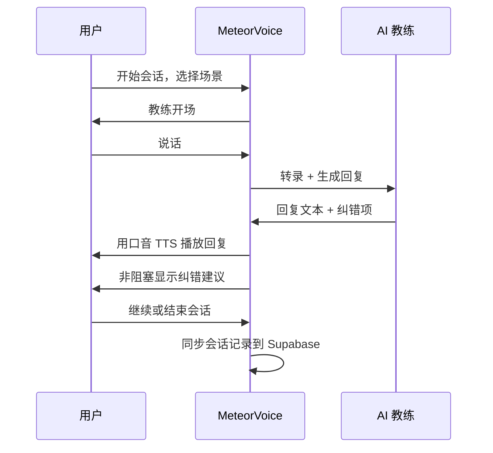
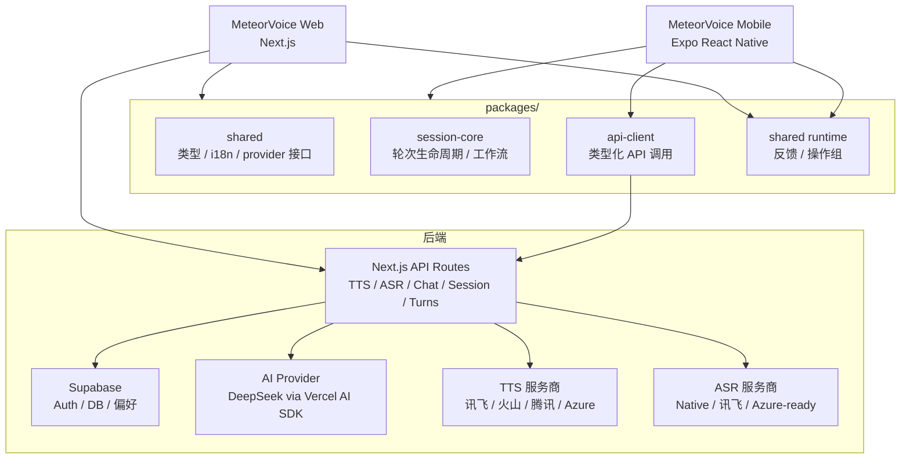
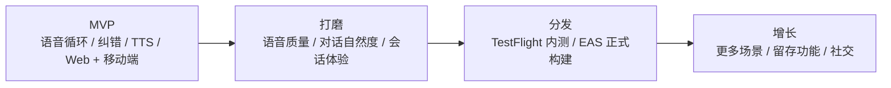

# MeteorVoice

<p align="center">
  <strong>以语音为核心的英语对话陪练，支持实时纠错、口音适配和跨设备同步</strong>
</p>

<p align="center">
  
  
  
  
  <br />
  <a href="https://github.com/JunchenMeteor/MeteorVoice/issues"></a>
  <br />
  <a href="README.md"></a>
  <a href="README.zh-CN.md"></a>
</p>

MeteorVoice 是一个以语音为核心的英语对话陪练工具。用户选择场景后开始对话，自然说话，AI 教练实时纠错并用适配口音回复。会话记录通过 Supabase 跨设备同步。

## 目录

- [维护者](#维护者)
- [背景](#背景)
- [核心能力](#核心能力)
- [系统架构](#系统架构)
- [项目结构](#项目结构)
- [安装](#安装)
- [运行](#运行)
- [移动端](#移动端)
- [TTS 服务商](#tts-服务商)
- [验证](#验证)
- [Roadmap](#roadmap)

## 维护者

MeteorVoice 由 **Meteor** 发起并维护。

项目专注于通过自然 AI 对话进行英语口语练习，核心目标是语音质量和对话自然度，而不是语法题库。用户应该真的想继续说下去，而不是完成任务。

## 背景

大多数英语学习应用都陷入两个误区：

- 本质是阅读或写作工具，只是套了语音输入的壳。
- 有语音输入，但 TTS 回复机械，沉浸感立刻破坏。

MeteorVoice 从相反的方向出发：语音质量和对话自然度优先。纠错不打断对话，以非阻塞方式显示在旁边。AI 教练跟随用户说的内容回应，而不是把话题引向固定脚本。



## 核心能力

- 与 AI 教练一对一语音对话
- 场景式对话开场（面试、旅行、餐厅、职场、日常闲聊）
- 实时纠错，涵盖语法、词汇、流利度和发音
- 会话级口音适配（美式、英式、印度、澳洲等）
- 非阻塞纠错面板——纠错建议不打断对话
- 对话区外支持中英双语 UI
- AI 回复语言路由和 ASR 识别语言分离，避免中英文设置互相覆盖
- 基于 CSS 自定义属性的全局主题切换
- 通过 Supabase 管理登录、历史记录和偏好同步
- 统一 ASR provider 层，支持讯飞启动会话、iOS 原生 PCM 采集和诊断
- 统一运行时反馈能力，覆盖加载、阻断操作、网络错误和 401 强制登出
- 高成本 AI、TTS、ASR、会话接口增加登录态保护
- 提供 mock AI/STT/TTS，无需 API Key 即可本地开发
- 基于 Expo React Native 的原生移动端（iOS/Android）

## 系统架构



职责边界：

- `apps/web`：Next.js 全栈应用——UI、API 路由、服务端 TTS/AI 编排。
- `apps/mobile`：Expo React Native 原生客户端——语音会话 UI、原生音频、原生 PCM 采集、后台保活。
- `packages/shared`：跨端类型、i18n 文案、provider 接口、ASR/TTS 能力表、反馈状态和操作组。
- `packages/session-core`：平台无关的轮次生命周期和工作流状态机。
- `packages/api-client`：Web 和 Mobile 共用的类型化 API 客户端，包含请求超时和统一错误格式化。

设置同步现在区分全量刷新和局部更新：

- 进入页面、登录、前后台恢复和手动刷新使用 grouped operation，多个接口共享一个 loading 状态。
- 单项设置保存成功后，以 `/api/preferences` 返回结果为准，只应用受影响的设置域。
- AI 回复语言通过 `responseLocale` 传递；ASR 识别语言单独通过 `languageMode` 配置。

## 项目结构

```text
MeteorVoice/
├── apps/
│   ├── web/                  Next.js Web 应用
│   │   ├── app/              页面和 API 路由
│   │   ├── components/       可复用 UI 组件
│   │   └── lib/
│   │       ├── providers/    TTS / STT / AI 适配层
│   │       └── server/       服务端业务逻辑
│   └── mobile/               Expo React Native 应用
├── packages/
│   ├── shared/               类型、i18n、provider 接口
│   ├── session-core/         轮次生命周期和工作流
│   └── api-client/           类型化 API 客户端
├── supabase/migrations/      按序执行的 SQL 迁移文件
└── docs/                     产品和架构文档
```

分层规则和架构决策详见 `docs/project-structure.md`。

## 安装

### 1. 安装依赖

```bash
npm install
```

### 2. 创建 Supabase 项目

在 [supabase.com](https://supabase.com) 创建免费项目，然后在 SQL Editor 中按顺序执行：

```text
supabase/migrations/001_init.sql
supabase/migrations/002_rls.sql
supabase/migrations/003_tts_preferences.sql
```

### 3. 配置环境变量

```bash
cd apps/web
cp .env.local.example .env.local
```

填入：

```text
NEXT_PUBLIC_SUPABASE_URL=https://your-project.supabase.co
NEXT_PUBLIC_SUPABASE_ANON_KEY=your-supabase-anon-key
SUPABASE_SERVICE_ROLE_KEY=your-service-role-key
DEEPSEEK_API_KEY=your-deepseek-api-key        # 可选，不填则使用 mock AI
```

ASR/TTS 服务商密钥（均可选，不填则使用 mock/native 兜底）：

```text
ASR_PROVIDER=native
TTS_PROVIDER=mock
XUNFEI_APP_ID=
XUNFEI_API_KEY=
XUNFEI_API_SECRET=
XUNFEI_ASR_PRODUCT=zh_iat
XUNFEI_TTS_VOICE=                 # 默认兜底 vcn；具体教练声音在设置页选择
VOLCENGINE_ACCESS_KEY=
VOLCENGINE_SECRET_KEY=
TENCENT_SECRET_ID=
TENCENT_SECRET_KEY=
AZURE_SPEECH_KEY=
AZURE_SPEECH_REGION=eastasia
```

### 4. 配置 Supabase 认证

在 Supabase 控制台 Authentication → URL Configuration 中：

- Site URL：`http://127.0.0.1:3001`
- Redirect URLs：`http://127.0.0.1:3001/**`

## 运行

```bash
cd apps/web
npm run dev
```

打开 `http://127.0.0.1:3001`

不配置任何 API Key 也能以 mock 模式完整运行。真实 AI 回复需要 `DEEPSEEK_API_KEY`，真实语音输出需要至少一个 TTS 服务商密钥。远端 ASR 需要配置服务商密钥和 `ASR_PROVIDER`；否则移动端可以使用原生语音识别。

## 移动端

移动端基于 Expo React Native，支持 iOS 和 Android。

### 本地构建（需要 Mac + Xcode）

```bash
cd apps/mobile
npx expo run:ios
```

### EAS 云端构建

```bash
npm install -g eas-cli
eas login
cd apps/mobile
eas build --platform ios --profile preview
```

`preview` profile 生成可通过 Xcode → Devices 直接安装的 `.ipa`，无需提交 App Store。

后台音频保活已在 `app.json` 中启用（`UIBackgroundModes: audio`）。此功能需要 EAS 构建或本地 Xcode 构建，Expo Go 中无法测试。

在 `apps/mobile/app.json` 中配置 API 地址：

```json
"extra": {
  "apiBaseUrl": "https://meteorvoice.jcmeteor.com",
  "apiBaseUrlPreview": "https://mv-pre.jcmeteor.com"
}
```

## TTS 服务商

国内用户推荐使用以下服务商：

| 服务商 | Key | 说明 |
|--------|-----|------|
| 讯飞 | `xunfei` | 推荐首选 |
| 火山引擎 | `volcengine` | 字节跳动 TTS |
| 腾讯云 | `tencent` | 备选方案 |
| Mock / 浏览器 | `mock` | 默认，无需密钥 |
| Azure Neural TTS | `azure` | 支持全部口音，永久免费额度 |

用户选择的服务商保存在 Supabase 中，服务商密钥只存在服务端环境变量里。

详见 `docs/tts-integration.md`。

## ASR 服务商

MeteorVoice 现在提供统一 ASR provider 层：

| 服务商 | Key | 状态 |
|--------|-----|------|
| 原生移动端语音识别 | `native` | 默认兜底 |
| 讯飞 `zh_iat` | `xunfei` | 已支持签名 WebSocket 启动和 iOS PCM streaming 路径 |
| Azure Speech | `azure` | 合约已准备，运行时 adapter 待接入 |

ASR 层和 AI 回复语言路由是分离的：`ASR languageMode` 只控制识别语言，`responseLocale` 控制教练回复语言。

合约、落地路径、诊断和测试说明详见 `docs/asr-provider-layer.md`。

## 验证

```bash
npx vitest run   # 单元测试
npm run build    # 生产构建检查
```

## Roadmap



### 技术演进

| 阶段 | 内容 | 状态 |
|------|------|------|
| **MVP** | 语音循环、纠错、TTS、Web 端完整可用 | ✅ 已交付 |
| **双端架构** | `apps/web` + `apps/mobile` + `packages/*` monorepo | ✅ 已交付 |
| **沉浸式 UI** | 语音波形、桌面/移动双布局、实时字幕 | ✅ 已交付 |
| **产品化** | 历史页详展/分页、Preferences 跨设备同步、CI 并行化、Mobile 音频硬化 | ✅ 已交付 |
| **三合一层级判停** | L1 本地判断 + L2 LLM 语义判停 + L3 安全网，替代固定静默等待 | ✅ 已交付 |
| **ASR provider 层** | 统一 ASR 合约、讯飞启动会话、原生 PCM 诊断、移动端会话接入 | ✅ 已交付 |
| **口音能力专项** | TTS provider voice catalog，多口音发音人（美式/英式/印度/澳式） | 🚧 实现中 |
| **分发** | TestFlight 内测、EAS 正式构建 | 📋 待排期 |
