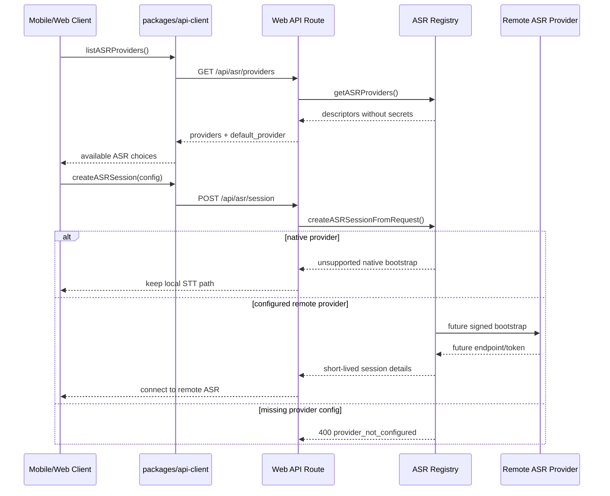

# ASR Provider Layer

This document is the executable implementation guide for the shared ASR provider layer. It defines the contracts, files, provider responsibilities, rollout steps, and test plan for moving speech recognition from a mobile-only native path to a shared provider architecture.

## Current Status

- Implemented: shared ASR types, provider capability registry, runtime adapter boundary, API client methods, server provider registry, `/api/asr/providers`, `/api/asr/session`, Xunfei `zh_iat` signed WebSocket bootstrap, API abuse guard, mobile ASR bootstrap diagnostics, native PCM capture, direct Xunfei streaming diagnostic, P4 evaluation report, and contract tests.
- Diagnostic-only: mobile can capture microphone PCM on iOS and stream it directly to Xunfei `zh_iat` from the Settings ASR diagnostic, then export P4 metrics for native-vs-remote comparison.
- Not implemented yet: production mobile session switching, transcript event ingestion into the live turn state machine, WebSocket relay, and non-Xunfei remote adapters.
- Production behavior remains unchanged: mobile live sessions still use `expo-speech-recognition` through `apps/mobile/src/nativeSpeech.ts`.

## Target Outcome

The final user-visible goal is faster and more accurate voice input while keeping the session state machine stable:

1. Mobile can query which ASR providers are available before a session starts.
2. Mobile can request a provider session without knowing provider secrets.
3. Server can bootstrap remote ASR providers with signed URLs or short-lived tokens.
4. Session code can switch between native ASR and remote ASR through one interface.
5. Metrics can compare native ASR latency and remote ASR latency before changing the default provider.

## Architecture

```mermaid
flowchart TD
  MobileSession[apps/mobile session screen] --> ApiClient[packages/api-client]
  WebSession[apps/web session UI] --> ApiClient
  ApiClient --> ProvidersRoute[/api/asr/providers]
  ApiClient --> SessionRoute[/api/asr/session]
  ProvidersRoute --> ServerRegistry[apps/web/lib/server/asr.ts]
  SessionRoute --> ServerRegistry
  ServerRegistry --> SharedContracts[packages/shared/src/asr.ts]
  ServerRegistry --> XunfeiSigner[xunfei zh_iat signer]
  ServerRegistry --> AzureSigner[future azure signer]
  ServerRegistry --> TencentSigner[future tencent signer]
  ServerRegistry --> VolcengineSigner[future volcengine signer]
```

## Runtime Flow



## Files And Responsibilities

### `packages/shared/src/asr.ts`

Owns platform-neutral contracts. This file must not import web, mobile, Node-only, or provider SDK code.

Exported types and helpers:

- `ASRProviderKey`: `native | xunfei | azure | tencent | volcengine`.
- `ASRMode`: `single_utterance | streaming | file`.
- `ASRLanguageMode`: `english | mandarin | mixed_zh_en | auto`.
- `ASRProviderCapability`: provider capability declaration.
- `ASRProviderDescriptor`: public provider metadata returned to clients.
- `ASRSessionConfig`: normalized runtime options.
- `ASRSessionBootstrapRequest`: client request body for `/api/asr/session`.
- `ASRSessionBootstrapResponse`: server response for a provider session.
- `ASRTranscriptEvent`: common transcript event shape for later native/remote adapters.
- `asrProviderCapabilities`: source of truth for planned provider capability.
- `createASRProviderDescriptor(key, options)`: creates safe public descriptors.
- `normalizeASRProviderKey(value, fallback)`: validates external input.
- `normalizeASRSessionConfig(input)`: clamps mode, language, endpoint, and duration settings.

### `packages/api-client/src/types.ts`

Owns API DTOs used by web and mobile:

- `ListASRProvidersResponse`
- `CreateASRSessionRequest`
- `CreateASRSessionResponse`

### `packages/api-client/src/client.ts`

Owns client calls:

- `listASRProviders()` calls `GET /api/asr/providers`.
- `createASRSession(input)` calls `POST /api/asr/session`.

### `apps/web/lib/server/asr.ts`

Owns server-side registry and provider bootstrap orchestration.

Current functions:

- `getASRProviders()`: returns provider descriptors. It never returns secrets.
- `getDefaultASRProvider()`: resolves `ASR_PROVIDER`, falling back to `native`.
- `createASRSessionFromRequest(input)`: validates provider availability and returns either native unsupported bootstrap, missing config errors, or a 501 remote bootstrap placeholder.

Future provider-specific implementation should add small server-only helpers under `apps/web/lib/providers/`, for example:

- `apps/web/lib/providers/xunfei-asr.ts`
- `apps/web/lib/providers/azure-asr.ts`
- `apps/web/lib/providers/tencent-asr.ts`
- `apps/web/lib/providers/volcengine-asr.ts`

Those helpers should return an `ASRSessionBootstrapResponse` and keep provider SDK/signature details out of `packages/shared`.

### `apps/web/app/api/asr/providers/route.ts`

Public provider discovery endpoint. Response:

```json
{
  "providers": [],
  "default_provider": "native"
}
```

### `apps/web/app/api/asr/session/route.ts`

Public bootstrap endpoint. Request shape:

```json
{
  "provider": "xunfei",
  "mode": "streaming",
  "languageMode": "mixed_zh_en",
  "scenarioKey": "small-talk",
  "sessionId": "session-id",
  "clientTraceId": "trace-id"
}
```

Xunfei `zh_iat` currently returns a short-lived signed WebSocket bootstrap response when `XUNFEI_ASR_*` credentials are configured. Other remote providers intentionally return `501` until a signer/relay exists.

## Abuse Guard

The ASR work also protects high-cost API routes because unauthenticated bot traffic can burn Vercel free resources and provider credits.

Server helper:

- File: `apps/web/lib/server/http.ts`
- Function: `guardApiRequest(request, options)`
- Checks:
  - `x-vercel-ip-country` against `API_GUARD_BLOCKED_COUNTRIES`, defaulting to `JP`.
  - Optional trusted client header: `X-MeteorVoice-Client`.
  - In-memory per route/IP rate bucket.
- Authentication:
  - High-cost routes call `requireApiUser()`.
  - Web requests authenticate with Supabase cookies.
  - Mobile requests authenticate with `Authorization: Bearer <supabase-access-token>`.
  - Unauthenticated requests return `401` before invoking AI, TTS, or ASR providers.

Trusted client header values:

- `meteorvoice-api-client`
- `meteorvoice-web`
- `meteorvoice-mobile`

Guarded routes:

- `/api/chat`
- `/api/tts`
- `/api/semantic-endpoint`
- `/api/preferences`
- `/api/asr/session`

This guard is a low-cost first line of defense. It is not a replacement for provider-side quotas, Vercel Firewall, or a durable distributed rate limiter. If abuse continues from many IPs, add a persistent limiter backed by Redis, Upstash, Supabase, or Vercel Firewall rules.

Mobile behavior:

- Starting a voice session now requires `auth.state === "signed-in"`.
- If the mobile user is not signed in, session start sends the user to Settings login instead of calling protected APIs.

## Environment Variables

Provider discovery checks these variables:

- Default provider: `ASR_PROVIDER`
- iFLYTEK: `XUNFEI_ASR_APP_ID`, `XUNFEI_ASR_API_KEY`, `XUNFEI_ASR_API_SECRET`
- Azure: `AZURE_SPEECH_KEY`, `AZURE_SPEECH_REGION`
- Tencent Cloud: `TENCENT_SECRET_ID`, `TENCENT_SECRET_KEY`
- Volcengine: `VOLCENGINE_ASR_APP_ID`, `VOLCENGINE_ASR_ACCESS_TOKEN`

Never expose these values to the client. API responses may expose only configured/enabled state and missing env var names.

## Rollout Steps

### P1: Shared Provider Layer

Goal: create stable contracts and discovery APIs without changing live session behavior.

Implementation:

1. Add `packages/shared/src/asr.ts`.
2. Export `./asr` from `packages/shared/package.json`.
3. Export ASR contracts from `packages/shared/src/index.ts`.
4. Add API client types and methods.
5. Add web server registry and API routes.
6. Add contract tests.

Done when:

- `npm test` passes.
- `GET /api/asr/providers` returns all planned providers.
- `POST /api/asr/session` returns native unsupported bootstrap for `native`.
- Remote providers return explicit 400 or 501, not silent fallback.

### P2: Provider Bootstrap

Goal: server can create short-lived remote ASR sessions.

Implementation:

1. Pick one provider for the first real adapter, based on accuracy, cost, and network quality. Do not assume it must be the current TTS provider.
2. Create one provider file under `apps/web/lib/providers/<provider>-asr.ts`.
3. Add a function with this shape:

```ts
export async function createXunfeiASRSession(config: ASRSessionConfig): Promise<ASRSessionBootstrapResponse>
```

4. Validate required env vars in the provider file.
5. Generate a short-lived signed WebSocket URL or token.
6. Return only endpoint, safe headers, query params, expiration, normalized config, and non-secret provider runtime parameters.
7. Route `createASRSessionFromRequest()` to the provider function.

Done when:

- Configured provider returns `status: "created"`.
- Missing credentials return 400 with a readable error.
- No server secret appears in response JSON, logs, or client bundles.

Current Xunfei implementation:

- File: `apps/web/lib/providers/xunfei-asr.ts`
- Function: `createXunfeiASRSession(config)`
- Endpoint: `wss://iat.xf-yun.com/v1`
- Product: `XUNFEI_ASR_PRODUCT=zh_iat`
- Audio contract for the future client adapter:
  - PCM/raw
  - 16 kHz
  - 16-bit
  - mono
  - 40 ms frame interval
  - 1280 bytes per frame
  - max user utterance target: 60 seconds

Mobile bootstrap diagnostic implementation:

- File: `apps/mobile/src/App.tsx`
- Function: `runASRDiagnostics()`
- UI entry: `apps/mobile/src/screens/SettingsScreen.tsx`, Voice diagnostics card, `ASR` button.
- Behavior:
  1. Requires a signed-in mobile user because `/api/asr/*` is a protected high-cost API surface.
  2. Calls `api.listASRProviders()` and records `asr_diagnostic_start` plus `asr_providers_loaded`.
  3. Selects enabled `xunfei` first, otherwise falls back to the configured default provider.
4. Calls `api.createASRSession()` with `mode: "streaming"` and `languageMode: "mixed_zh_en"`.
  5. Records `asr_session_bootstrap_end` or `asr_diagnostic_error`.
  6. If Xunfei returns a WebSocket bootstrap, runs the P3 streaming diagnostic described below.
  7. Shows the result in Settings without changing production STT.

This diagnostic validates server credentials, API auth, provider selection, signed URL creation, mobile API reachability, direct provider WebSocket reachability, native PCM capture, and provider transcript parsing. It is intentionally not wired into live sessions yet.

Language routing note:

- ASR `languageMode` controls recognition only.
- AI response language is controlled separately by `ConversationContext.responseLocale`.
- Current Xunfei `zh_iat` diagnostic normalizes non-English requests to `mixed_zh_en`; this is intentional so Chinese and mixed Chinese-English speech can be evaluated without changing production session behavior.

### P3: Client Adapter Interface

Goal: mobile/web session code can consume native or remote ASR through one adapter boundary.

Current blocker:

- `expo-speech-recognition` returns transcripts, not microphone audio frames.
- `expo-audio` recording presets produce files such as AAC/M4A, not real-time 16 kHz 16-bit mono PCM frames.
- Xunfei `zh_iat` streaming expects raw PCM frames over WebSocket, so the mobile client cannot simply route the existing Expo transcript stream into remote ASR.

Implementation options:

1. Native PCM capture adapter:
   - Add an Expo Modules API native module under `apps/mobile/modules/` that owns microphone capture.
   - Emit 16 kHz, 16-bit, mono PCM frames to JavaScript or stream them natively to the provider relay.
   - Keep `nativeSpeech.ts` as the existing fallback until the remote path is proven on device.
2. Server relay with file upload:
   - Use Expo recording to create a file after user speech ends.
   - Upload the file to the API.
   - Transcode server-side to provider-required PCM and send to ASR.
   - This is easier to prototype but adds full-utterance upload latency and needs server ffmpeg/transcoding support.
3. Browser/Web adapter:
   - Use browser audio APIs only for web runtime.
   - Do not reuse it for iOS native unless the app runtime actually provides the same PCM access.

Current P3 diagnostic implementation:

1. A dedicated Expo Modules API module captures iOS microphone audio instead of extending `expo-speech-recognition`.
2. Settings diagnostics call `/api/asr/session`, open the returned Xunfei signed WebSocket URL, and stream native PCM frames for an 8-second window.
3. The diagnostic emits frame count, byte count, duration, sample rate, channels, provider partials, provider errors, and final transcript text into the existing Voice diagnostics log.
4. `expo-speech-recognition` remains the production live-session STT path during this phase.
5. `expo-audio` remains the TTS playback path; the PCM module does not replace playback.
6. The remote transcript is displayed only in Settings. It is not fed into `acceptTranscriptTurn()` or the session state machine.

Native PCM module:

- Package: `apps/mobile/modules/voice-pcm-capture`
- iOS module: `apps/mobile/modules/voice-pcm-capture/ios/VoicePcmCaptureModule.swift`
- JS wrapper: `apps/mobile/src/voicePcmCapture.ts`
- Module name: `VoicePcmCapture`
- Events:
  - `onPcmCaptureFrame`: emits `audioBase64`, `sequence`, `byteCount`, `sampleRate`, `channels`, `bitDepth`, `durationMs`, `elapsedMs`.
  - `onPcmCaptureState`: emits `started`, `stopped`, or `error` plus capture status.
- Functions:
  - `start({ sampleRate?: number, frameDurationMs?: number }): Promise<PcmCaptureStatus>`
  - `stop(reason?: string): Promise<PcmCaptureStatus>`
  - `getStatus(): Promise<PcmCaptureStatus>`
- Audio session:
  - Category: `playAndRecord`
  - Mode: `voiceChat`
  - Options: `allowBluetoothHFP`, `defaultToSpeaker`
  - Output override: speaker
- Output format:
  - 16 kHz
  - 16-bit signed PCM
  - mono
  - 40 ms frame interval
  - 1280 bytes per frame

Direct Xunfei diagnostic:

- File: `apps/mobile/src/App.tsx`
- Functions:
  - `runASRDiagnostics()`
  - `runXunfeiASRStreamingDiagnostic(session, startedAt)`
  - `runXunfeiDiagnosticWebSocket(session)`
  - `createXunfeiASRFrame(session, status, audioBase64)`
  - `extractXunfeiTranscript(payload)`
- Runtime sequence:
  1. User taps Settings -> Voice diagnostics -> `ASR`.
  2. Mobile verifies the user is signed in.
  3. Mobile calls provider discovery and creates an Xunfei ASR session.
  4. Mobile cancels any current local STT listener before the diagnostic capture starts.
  5. Mobile opens `session.endpointUrl` with `WebSocket`.
  6. On socket open, mobile starts native PCM capture.
  7. First audio frame sends Xunfei `status: 0` with `common`, `business`, and `data`.
  8. Middle frames send Xunfei `status: 1` with `data`.
  9. After 8 seconds, mobile stops native capture and sends Xunfei `status: 2` with empty audio.
  10. Provider messages are parsed from `data.result.ws[].cw[].w`.
  11. The diagnostic resolves when Xunfei sends `data.status === 2`, the socket closes, or the hard 12-second timeout fires.
  12. Settings shows either `ASR diagnostic transcript: ...` or frame/byte counts when no transcript is returned.

Diagnostics emitted:

- `asr_diagnostic_start`
- `asr_providers_loaded`
- `asr_session_bootstrap_end`
- `asr_stream_start`
- `asr_pcm_state`
- `asr_pcm_frame`
- `asr_partial`
- `asr_stream_provider_error`
- `asr_stream_done`
- `asr_diagnostic_error`

Manual validation for this P3 PR:

1. Install a fresh device build that includes the `VoicePcmCapture` native module.
2. Sign in on mobile.
3. Open Settings.
4. Tap Voice diagnostics -> `ASR`.
5. Speak one short mixed Chinese-English sentence during the 8-second listening window.
6. Confirm Settings shows a transcript or meaningful frame/byte counts.
7. Export/share Voice diagnostics logs.
8. Confirm production `/session` still uses the old native STT path and does not consume the diagnostic transcript.

Known limitation:

- This direct-to-provider path exposes only a short-lived signed Xunfei WebSocket URL to the mobile client. It still does not expose API key or API secret, but all provider traffic goes from device to Xunfei. A future server relay can hide even the signed provider URL, centralize provider retries, and normalize transcript events before they reach the app.

Implementation:

1. Use the shared runtime interface:

```ts
type ASRRuntimeAdapter = {
  provider: ASRProviderKey
  start(config: ASRSessionConfig): Promise<void>
  stop(reason?: string): Promise<void>
  onEvent(listener: (event: ASRTranscriptEvent) => void): () => void
}
```

2. Keep `nativeSpeech.ts` as the `native` adapter.
3. Add a remote adapter that calls `createASRSession()` and connects to provider transport.
4. Feed `ASRTranscriptEvent` into the existing turn guard only when `event.type === "final"` and `event.isFinal === true`.
5. Preserve the current TTS/STT order rules in `docs/development-rules.md`.

Done when:

- Current native path behaves the same as before.
- Remote provider can be enabled behind a config flag.
- Remote path receives real user audio and returns `ASRTranscriptEvent` results.
- TTS playback still blocks user transcript handling.
- Each real utterance creates at most one AI turn.

### P4: Latency And Accuracy Evaluation

Goal: compare native ASR and remote ASR before changing defaults.

Required metrics:

- `stt_start`
- `stt_first_partial`
- `stt_submit`
- `stt_end`
- `asr_diagnostic_start`
- `asr_auth_checked`
- `asr_providers_loaded`
- `asr_session_bootstrap_start`
- `asr_session_bootstrap_end`
- `asr_stream_start`
- `asr_pcm_frame`
- `asr_first_partial`
- `asr_partial`
- `asr_final`
- `asr_stream_done`
- `asr_stream_provider_error`
- `asr_diagnostic_error`
- `coach_reply_ready`
- `tts_ready`
- `playback_started`

Evaluation method:

1. Clear Settings -> Voice diagnostics logs.
2. Start a normal mobile session and say the native test prompt.
3. Wait for the AI reply to complete so native STT, AI, and TTS timing markers are captured.
4. Open Settings -> Voice diagnostics and tap `ASR`.
5. Say the same prompt during the 8-second Xunfei diagnostic window.
6. Tap `P4` to export the compact ASR P4 evaluation report.
7. Tap `Share` to export raw voice metrics when deeper debugging is needed.
8. Repeat with Chinese, English, and mixed Chinese-English prompts.
9. Compare:
   - native `stt_first_partial.elapsedMs` vs remote `asr_first_partial.elapsedMs`
   - native `stt_submit.elapsedMs` vs remote `asr_stream_done.streamElapsedMs`
   - transcript text shown by the native session vs `ASR diagnostic transcript`
   - provider errors, no-transcript runs, and frame/byte counts

Current mobile P4 implementation:

- File: `apps/mobile/src/App.tsx`
- Report builder: `createASREvaluationReport(entries)`
- Native timing source: `stt_start`, `stt_first_partial`, `stt_submit`, `stt_end`
- Remote timing source: `asr_stream_start`, `asr_first_partial`, `asr_final`, `asr_stream_done`
- UI entry: Settings -> Voice diagnostics -> `P4`
- Export title: `MeteorVoice ASR P4 evaluation`
- Production STT remains unchanged; this report does not switch live sessions to remote ASR.

Done when:

- Remote ASR improves transcript quality enough to justify network cost.
- Speech-end to final latency is acceptable on a real device in China.
- Session does not get stuck after silence, background/foreground, or page transitions.
- P4 report includes at least one native run and one remote run for the same scripted prompt.

## Testing

Automated:

```bash
npm run lint
npm test
npm run mobile:config
```

Manual API checks:

```bash
curl -s http://127.0.0.1:3001/api/asr/providers
curl -s -X POST http://127.0.0.1:3001/api/asr/session \
  -H 'Content-Type: application/json' \
  -d '{"provider":"native"}'
```

Manual mobile checks after production wiring:

1. Start a session and say one short sentence.
2. Confirm one final transcript creates one AI reply.
3. Stay silent for 20 seconds; session must remain ready.
4. Play TTS; ASR must not treat TTS audio as user speech.
5. Background and foreground the app; session must recover without duplicate turns.
6. Leave `/session` and return; active sessions may resume, ended sessions must not.

## Provider Selection Rules

Default behavior:

1. Use `ASR_PROVIDER` if configured and enabled.
2. Fall back to `native`.
3. Never silently fall back from a requested remote provider to another remote provider.
4. Return explicit 400 for missing credentials.
5. Return explicit 501 for configured providers whose signer is not implemented.

Provider choice should be based on measured quality and latency, not on the current TTS vendor.
