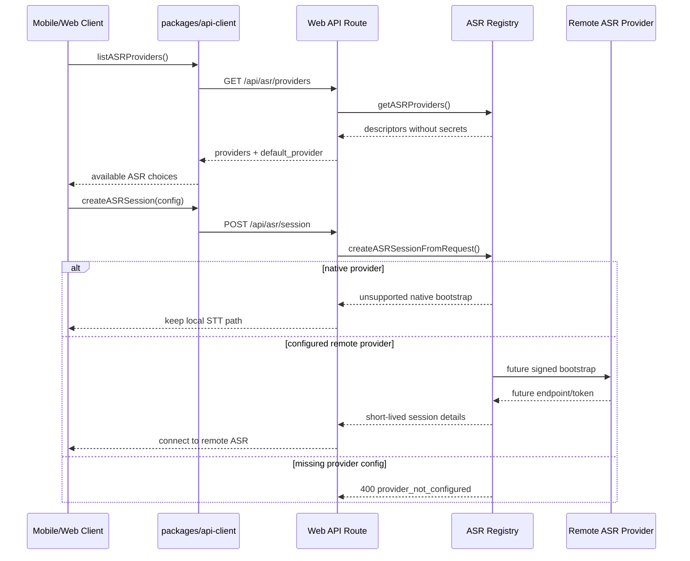

# ASR Provider Layer

This document is the executable implementation guide for the shared ASR provider layer. It defines the contracts, files, provider responsibilities, rollout steps, and test plan for moving speech recognition from a mobile-only native path to a shared provider architecture.

## Current Status

- Implemented: shared ASR types, provider capability registry, API client methods, server provider registry, `/api/asr/providers`, `/api/asr/session`, and contract tests.
- Not implemented yet: provider-specific remote ASR signing, WebSocket relay, audio upload, and production mobile session switching.
- Production behavior remains unchanged: mobile live sessions still use `expo-speech-recognition` through `apps/mobile/src/nativeSpeech.ts`.

## Target Outcome

The final user-visible goal is faster and more accurate voice input while keeping the session state machine stable:

1. Mobile can query which ASR providers are available before a session starts.
2. Mobile can request a provider session without knowing provider secrets.
3. Server can bootstrap remote ASR providers with signed URLs or short-lived tokens.
4. Session code can switch between native ASR and remote ASR through one interface.
5. Metrics can compare native ASR latency and remote ASR latency before changing the default provider.

## Architecture

```mermaid
flowchart TD
  MobileSession[apps/mobile session screen] --> ApiClient[packages/api-client]
  WebSession[apps/web session UI] --> ApiClient
  ApiClient --> ProvidersRoute[/api/asr/providers]
  ApiClient --> SessionRoute[/api/asr/session]
  ProvidersRoute --> ServerRegistry[apps/web/lib/server/asr.ts]
  SessionRoute --> ServerRegistry
  ServerRegistry --> SharedContracts[packages/shared/src/asr.ts]
  ServerRegistry --> XunfeiSigner[future xunfei signer]
  ServerRegistry --> AzureSigner[future azure signer]
  ServerRegistry --> TencentSigner[future tencent signer]
  ServerRegistry --> VolcengineSigner[future volcengine signer]
```

## Runtime Flow



## Files And Responsibilities

### `packages/shared/src/asr.ts`

Owns platform-neutral contracts. This file must not import web, mobile, Node-only, or provider SDK code.

Exported types and helpers:

- `ASRProviderKey`: `native | xunfei | azure | tencent | volcengine`.
- `ASRMode`: `single_utterance | streaming | file`.
- `ASRLanguageMode`: `english | mandarin | mixed_zh_en | auto`.
- `ASRProviderCapability`: provider capability declaration.
- `ASRProviderDescriptor`: public provider metadata returned to clients.
- `ASRSessionConfig`: normalized runtime options.
- `ASRSessionBootstrapRequest`: client request body for `/api/asr/session`.
- `ASRSessionBootstrapResponse`: server response for a provider session.
- `ASRTranscriptEvent`: common transcript event shape for later native/remote adapters.
- `asrProviderCapabilities`: source of truth for planned provider capability.
- `createASRProviderDescriptor(key, options)`: creates safe public descriptors.
- `normalizeASRProviderKey(value, fallback)`: validates external input.
- `normalizeASRSessionConfig(input)`: clamps mode, language, endpoint, and duration settings.

### `packages/api-client/src/types.ts`

Owns API DTOs used by web and mobile:

- `ListASRProvidersResponse`
- `CreateASRSessionRequest`
- `CreateASRSessionResponse`

### `packages/api-client/src/client.ts`

Owns client calls:

- `listASRProviders()` calls `GET /api/asr/providers`.
- `createASRSession(input)` calls `POST /api/asr/session`.

### `apps/web/lib/server/asr.ts`

Owns server-side registry and provider bootstrap orchestration.

Current functions:

- `getASRProviders()`: returns provider descriptors. It never returns secrets.
- `getDefaultASRProvider()`: resolves `ASR_PROVIDER`, falling back to `native`.
- `createASRSessionFromRequest(input)`: validates provider availability and returns either native unsupported bootstrap, missing config errors, or a 501 remote bootstrap placeholder.

Future provider-specific implementation should add small server-only helpers under `apps/web/lib/providers/`, for example:

- `apps/web/lib/providers/xunfei-asr.ts`
- `apps/web/lib/providers/azure-asr.ts`
- `apps/web/lib/providers/tencent-asr.ts`
- `apps/web/lib/providers/volcengine-asr.ts`

Those helpers should return an `ASRSessionBootstrapResponse` and keep provider SDK/signature details out of `packages/shared`.

### `apps/web/app/api/asr/providers/route.ts`

Public provider discovery endpoint. Response:

```json
{
  "providers": [],
  "default_provider": "native"
}
```

### `apps/web/app/api/asr/session/route.ts`

Public bootstrap endpoint. Request shape:

```json
{
  "provider": "xunfei",
  "mode": "streaming",
  "languageMode": "mixed_zh_en",
  "scenarioKey": "small-talk",
  "sessionId": "session-id",
  "clientTraceId": "trace-id"
}
```

Current remote provider response is intentionally `501` until a signer/relay exists.

## Environment Variables

Provider discovery checks these variables:

- Default provider: `ASR_PROVIDER`
- iFLYTEK: `XUNFEI_ASR_APP_ID`, `XUNFEI_ASR_API_KEY`, `XUNFEI_ASR_API_SECRET`
- Azure: `AZURE_SPEECH_KEY`, `AZURE_SPEECH_REGION`
- Tencent Cloud: `TENCENT_SECRET_ID`, `TENCENT_SECRET_KEY`
- Volcengine: `VOLCENGINE_ASR_APP_ID`, `VOLCENGINE_ASR_ACCESS_TOKEN`

Never expose these values to the client. API responses may expose only configured/enabled state and missing env var names.

## Rollout Steps

### P1: Shared Provider Layer

Goal: create stable contracts and discovery APIs without changing live session behavior.

Implementation:

1. Add `packages/shared/src/asr.ts`.
2. Export `./asr` from `packages/shared/package.json`.
3. Export ASR contracts from `packages/shared/src/index.ts`.
4. Add API client types and methods.
5. Add web server registry and API routes.
6. Add contract tests.

Done when:

- `npm test` passes.
- `GET /api/asr/providers` returns all planned providers.
- `POST /api/asr/session` returns native unsupported bootstrap for `native`.
- Remote providers return explicit 400 or 501, not silent fallback.

### P2: Provider Bootstrap

Goal: server can create short-lived remote ASR sessions.

Implementation:

1. Pick one provider for the first real adapter, based on accuracy, cost, and network quality. Do not assume it must be the current TTS provider.
2. Create one provider file under `apps/web/lib/providers/<provider>-asr.ts`.
3. Add a function with this shape:

```ts
export async function createXunfeiASRSession(config: ASRSessionConfig): Promise<ASRSessionBootstrapResponse>
```

4. Validate required env vars in the provider file.
5. Generate a short-lived signed WebSocket URL or token.
6. Return only endpoint, safe headers, query params, expiration, and normalized config.
7. Route `createASRSessionFromRequest()` to the provider function.

Done when:

- Configured provider returns `status: "created"`.
- Missing credentials return 400 with a readable error.
- No server secret appears in response JSON, logs, or client bundles.

### P3: Client Adapter Interface

Goal: mobile/web session code can consume native or remote ASR through one adapter boundary.

Implementation:

1. Add a session-side interface in the platform layer:

```ts
type ASRRuntimeAdapter = {
  start(config: ASRSessionConfig): Promise<void>
  stop(reason?: string): Promise<void>
  onEvent(listener: (event: ASRTranscriptEvent) => void): () => void
}
```

2. Keep `nativeSpeech.ts` as the `native` adapter.
3. Add a remote adapter that calls `createASRSession()` and connects to provider transport.
4. Feed `ASRTranscriptEvent` into the existing turn guard only when `event.type === "final"` and `event.isFinal === true`.
5. Preserve the current TTS/STT order rules in `docs/development-rules.md`.

Done when:

- Current native path behaves the same as before.
- Remote provider can be enabled behind a config flag.
- TTS playback still blocks user transcript handling.
- Each real utterance creates at most one AI turn.

### P4: Latency And Accuracy Evaluation

Goal: compare native ASR and remote ASR before changing defaults.

Required metrics:

- `asr_provider_selected`
- `asr_session_bootstrap_start`
- `asr_session_bootstrap_end`
- `asr_speech_start`
- `asr_partial`
- `asr_final`
- `asr_no_speech_timeout`
- `asr_error`
- `turn_locked`
- `ai_reply_start`
- `tts_playback_start`

Evaluation method:

1. Test native ASR and one remote provider with the same scripted prompts.
2. Include Chinese, English, and mixed Chinese-English utterances.
3. Measure time from speech end to `asr_final`.
4. Measure time from `asr_final` to `ai_reply_start`.
5. Compare transcript quality manually for names, mixed language, and punctuation.

Done when:

- Remote ASR improves transcript quality enough to justify network cost.
- Speech-end to final latency is acceptable on a real device in China.
- Session does not get stuck after silence, background/foreground, or page transitions.

## Testing

Automated:

```bash
npm run lint
npm test
npm run mobile:config
```

Manual API checks:

```bash
curl -s http://127.0.0.1:3001/api/asr/providers
curl -s -X POST http://127.0.0.1:3001/api/asr/session \
  -H 'Content-Type: application/json' \
  -d '{"provider":"native"}'
```

Manual mobile checks after production wiring:

1. Start a session and say one short sentence.
2. Confirm one final transcript creates one AI reply.
3. Stay silent for 20 seconds; session must remain ready.
4. Play TTS; ASR must not treat TTS audio as user speech.
5. Background and foreground the app; session must recover without duplicate turns.
6. Leave `/session` and return; active sessions may resume, ended sessions must not.

## Provider Selection Rules

Default behavior:

1. Use `ASR_PROVIDER` if configured and enabled.
2. Fall back to `native`.
3. Never silently fall back from a requested remote provider to another remote provider.
4. Return explicit 400 for missing credentials.
5. Return explicit 501 for configured providers whose signer is not implemented.

Provider choice should be based on measured quality and latency, not on the current TTS vendor.
