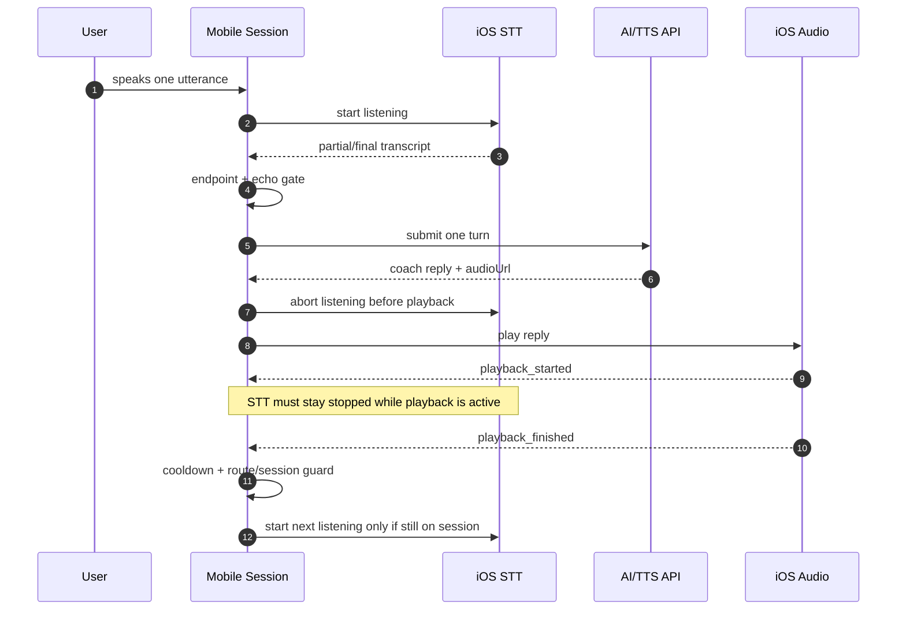
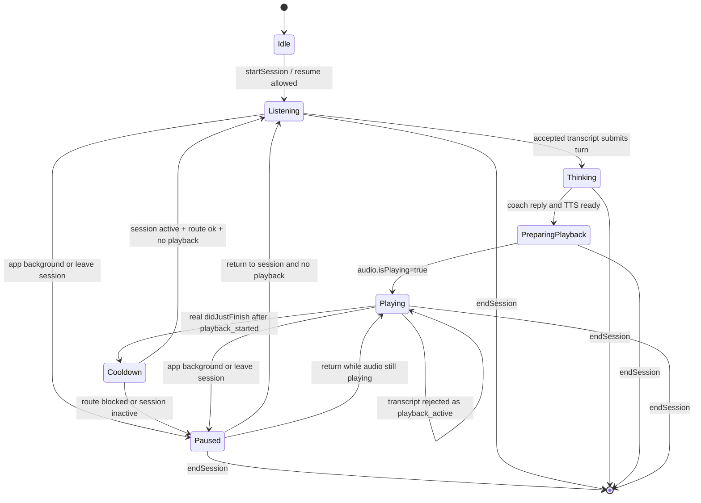

# Mobile Voice Runtime Flow

本文档说明 Mobile 会话页语音闭环的运行逻辑，重点覆盖 STT、TTS 播放、后台/前台、切 tab、回声拦截和日志导出。

## 核心目标

语音会话必须满足三条约束：

1. AI 回复播放期间不能启动 STT。
2. 用户离开会话页或 App 进入后台时必须停止 STT。
3. 播放真正结束后，才允许经过 cooldown 恢复 STT。

这三条约束优先级高于 UI 状态显示。也就是说，UI 显示 `listening` 不代表可以绕过 playback guard 启动 recognizer。

## 关键文件

| 文件 | 职责 |
| --- | --- |
| `apps/mobile/src/App.tsx` | 会话状态机、播放/STT 编排、tab/background route gate、voice metrics。 |
| `apps/mobile/src/nativeSpeech.ts` | `expo-speech-recognition` adapter，负责 STT start/result/abort、interim stable submit。 |
| `apps/mobile/src/nativeAudio.ts` | `expo-audio` adapter，负责 TTS audio playback、iOS playback audio session。 |
| `apps/mobile/src/voiceAudioSession.ts` | Optional Expo Swift module wrapper，当前用于 playback/recording session 兜底，不再介入 STT 主链路的 `voiceChat`。 |
| `packages/session-core/src/workflow.ts` | transcript gate、playback queue、cooldown 规则。 |
| `packages/session-core/src/endpointing.ts` | 本地 fast-path、semantic endpoint 判停、timeout。 |
| `packages/session-core/src/echo-guard.ts` | 播放结束后的 AI 自回声文本拦截。 |

## 主流程

### 效果总览

这张图表达用户真实看到和听到的结果：每一轮只允许一个用户输入、一个 AI 回复、一次播放和一次恢复监听。播放期间无论系统返回什么 STT 事件，都只能被丢弃或中止，不能进入下一轮 AI 请求。



### 运行状态图



### 异常场景效果

| 场景 | 期望效果 | 关键保护 |
| --- | --- | --- |
| TTS 刚设置 `audioUrl` 时收到旧 `didJustFinish` | 不恢复监听，继续等真实播放开始/结束 | `playbackStartedRef` 过滤 stale finish |
| 播放中系统误启动或返回 STT transcript | 立即 abort STT，丢弃 transcript，不提交 AI | `playbackActiveRef` + `audioPlayingRef` + `gateUserTranscript()` |
| 播放中切到 Settings/Home | 播放可继续，麦克风停止，不再恢复监听 | `selectTab()` 设置 route gate false |
| 播放中从 Settings/Home 快速切回 Session | 不立刻监听，等播放结束和 cooldown 后再恢复 | `selectTab('session')` 检查 playback/audio |
| 播放中 App 进后台再回前台 | 回前台不抢监听，播放状态优先 | `AppState` active 分支检查 playback/audio |
| AI 自己说的话被识别成用户输入 | 文本被 echo guard 丢弃，不触发新回复 | `transcript_echo_ignored` |

```mermaid
flowchart TD
  A[User taps Start] --> B[startSession]
  B --> C[STT startListening]
  C --> D[STT partial/final result]
  D --> E{Interim stable 850ms<br/>or final?}
  E -- no --> C
  E -- yes --> F[handleNativeFinalTranscript]
  F --> G{gateUserTranscript}
  G -- playback/cooldown/route rejected --> G1[abort STT if playback_active<br/>drop transcript]
  G -- accepted --> H{echo guard}
  H -- likely AI echo --> H1[drop transcript<br/>restart only if no playback]
  H -- real user input --> I[judgeEndpoint]
  I -- continue --> I1[pending transcript<br/>restart only if no playback]
  I -- submit --> J[submitTurn]
  J --> K[/api/chat coach reply]
  K --> L[/api/tts audioUrl]
  L --> M[set playbackActive=true<br/>set playbackStarted=false<br/>cancel STT]
  M --> N[expo-audio starts playback]
  N --> O[playback_started metric<br/>abort STT again]
  O --> P{didJustFinish?}
  P -- stale before playback_started --> P1[ignore finish]
  P -- real finish --> Q[playback_finished<br/>playbackActive=false]
  Q --> R[cooldown]
  R --> S{session active<br/>route ok<br/>not playback<br/>not audio playing?}
  S -- yes --> C
  S -- no --> S1[skip resume]
```

## 播放保护

`App.tsx` 使用以下 refs 作为真实运行态：

| ref | 含义 |
| --- | --- |
| `playbackActiveRef` | 当前业务上是否处于 AI/correction 播放阶段。 |
| `audioPlayingRef` | `expo-audio` 当前是否真实 playing。 |
| `playbackStartedRef` | 当前 `audioUrl` 是否已经真实进入过 playing。用于过滤 stale `didJustFinish`。 |
| `canListenOnRouteRef` | 当前 route 是否允许监听。切后台、离开 session tab 时为 false。 |
| `sessionActiveRef` | 当前 session 是否仍 active。 |

### 为什么需要 `playbackStartedRef`

`expo-audio` 的 `didJustFinish` 可能在切换新 `audioUrl` 时短暂保留旧值。如果只看 `didJustFinish=true && isPlaying=false`，可能会误判“新回复已经播放完”，从而提前恢复 STT。

规则：

```text
只有当前 audioUrl 已经触发过 audio.isPlaying=true，才接受 didJustFinish。
否则记录 playback_finish_ignored，并忽略这次 finish。
```

## STT 启动入口

所有启动 STT 的入口都必须满足：

```text
sessionActiveRef.current === true
canListenOnRouteRef.current === true
playbackActiveRef.current === false
audioPlayingRef.current === false
```

涉及入口：

| 入口 | 说明 |
| --- | --- |
| `startSession()` | 新 session 首次监听。 |
| `scheduleResumeListening()` | 播放结束 cooldown 后恢复。 |
| `onListeningEndedWithoutTranscript()` | iOS recognizer 无输入自然结束后恢复。 |
| `handleNativeFinalTranscript()` echo ignored 分支 | 丢弃 AI echo 后尝试恢复。 |
| `handleNativeFinalTranscript()` endpoint continue 分支 | 用户未说完时继续听。 |
| `AppState` active 分支 | 从后台回前台时恢复。 |
| `selectTab('session')` | 从其他 tab 回到会话页时恢复。 |

如果播放中仍收到 transcript，`gateUserTranscript()` 会返回 `playback_active`，此时必须调用 `speechCancelListeningRef.current()` abort STT。

## 无输入监听恢复

iOS speech recognizer 在非连续识别下可能因为用户长时间不开口而自然结束。Mobile active session 使用 `continuous: true` 降低自然结束和重启空窗；`onListeningEndedWithoutTranscript()` 是兜底恢复路径。这个结束不代表 session 结束，也不代表用户离开会话页。

`nativeSpeech.ts` 在 recognizer `end` 事件中记录：

| 字段 | 含义 |
| --- | --- |
| `cancelled` | 是否由 App 主动 stop/abort。 |
| `hadTranscript` | 本轮是否收到过 partial/final transcript。 |
| `submitted` | 是否已经提交 transcript 给会话状态机。 |
| `elapsedMs` | 本轮 recognizer 存活时间。 |

当 `cancelled=false`、`hadTranscript=false`、`submitted=false` 时，触发 `onListeningEndedWithoutTranscript()`。

App 只在以下条件都满足时重启监听：

```text
session active
route ok
not busy
playbackActiveRef false
audioPlayingRef false
```

日志判断：

| stage | 解释 |
| --- | --- |
| `stt_end` | recognizer 结束，包含是否取消、是否有 transcript。 |
| `stt_end_restart_scheduled` | 无输入自然结束后，App 安排短延迟恢复 STT。 |
| `stt_end_restart_skipped` | 因 busy/playback/route/session 不允许恢复。 |

## Tab 和后台

### 离开 Session Tab

`selectTab(tab)` 中，当 `tab !== 'session'`：

```text
canListenOnRouteRef = false
clear resume listening timer
endpointRequestRef += 1
pendingNativeTranscript = ''
abort STT
status = session.paused
```

播放可以继续，但 STT 不允许继续。

### 回到 Session Tab

当 `tab === 'session'`：

```text
canListenOnRouteRef = true
only start STT if:
  session active
  not busy
  playbackActiveRef false
  audioPlayingRef false
```

如果用户离开会话页时 AI 正在播放，快速切回来不会立刻启动 STT。必须等播放完成后，由 playback completion + cooldown 恢复。

### App 进入后台

`AppState` 非 active：

```text
canListenOnRouteRef = false
clear resume listening timer
endpointRequestRef += 1
pendingNativeTranscript = ''
abort STT
status = session.paused
```

`nativeAudio.ts` 同时会处理系统级播放/录音中断。

### App 回到前台

`AppState` active：

```text
canListenOnRouteRef = true
pull preferences
only start STT if no playback and no audio playing
```

## Endpoint 低延迟策略

`nativeSpeech.ts` 不只等系统 final：

- final result 正常提交。
- interim result 850ms 没变化时，以 `interim_stable` 提交。
- duplicate transcript 通过 `submittedTranscriptRef` 去重。

`endpointing.ts` 提供本地 fast-path：

- 英文短句如 `yes`, `no`, `repeat please` 直接 submit。
- 中文短句如 `断句`, `不会用`, `怎么说`, `再说一遍` 直接 submit。
- 不确定文本才走 `/api/semantic-endpoint`。
- semantic endpoint timeout 为 800ms。

## Voice Metrics

所有关键阶段都会输出 `voice-metrics`：

| stage | 解释 |
| --- | --- |
| `session_start` | 用户开始 session。 |
| `stt_start` | 系统 recognizer 启动。 |
| `stt_first_partial` | 第一次 partial 返回。 |
| `stt_submit` | final 或 interim stable 提交。 |
| `endpoint_start` | 开始判停。 |
| `endpoint_done` | 判停完成。 |
| `submit_turn_start` | 进入 AI 请求。 |
| `coach_reply_ready` | `/api/chat` 返回。 |
| `tts_ready` | `/api/tts` 返回。 |
| `playback_enqueued` | audioUrl 已进入播放队列。 |
| `playback_started` | 当前 audioUrl 真实进入 playing。 |
| `playback_finish_ignored` | stale finish 被忽略。 |
| `playback_finished` | 当前播放真实结束。 |
| `resume_listening_skipped` | cooldown 后因播放/route 等原因未恢复监听。 |
| `transcript_gate_rejected` | transcript 被 gate 拒绝。 |
| `transcript_echo_ignored` | transcript 被判定为 AI echo。 |

## 日志导出

App 内：

```text
Settings -> Voice diagnostics -> Share
```

Mac 命令行：

```bash
idevicesyslog -u 00008130-001E50C80AC0001C --no-colors -m voice-metrics -o ~/Documents/meteorvoice-voice-metrics.log
```

复现完成后按 `Ctrl + C`，打开：

```bash
open ~/Documents/meteorvoice-voice-metrics.log
```

分析时优先看一整轮从 `stt_start` 到 `playback_finished`，确认是否出现播放中 `stt_start` 或 `playback_finish_ignored`。
